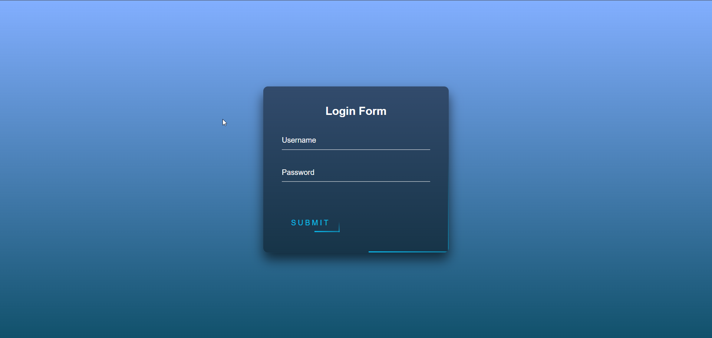
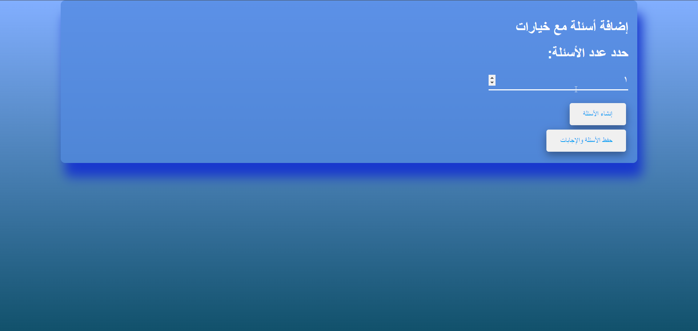
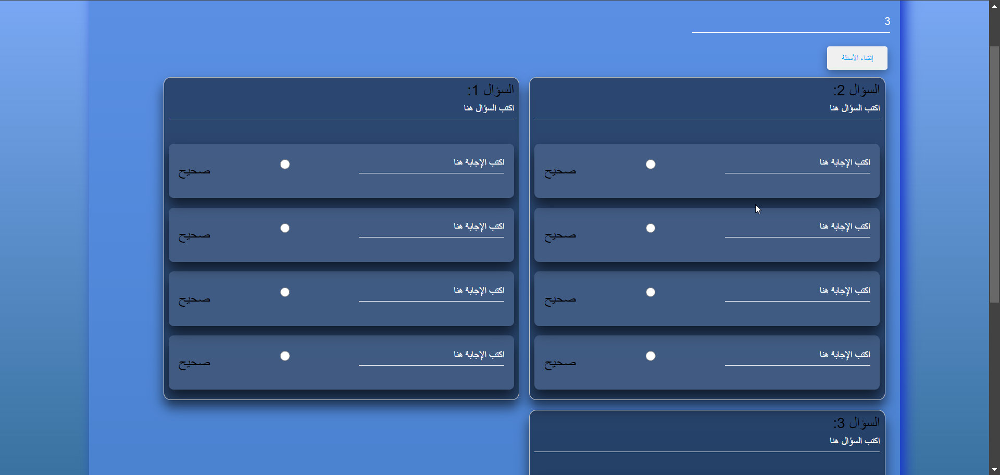
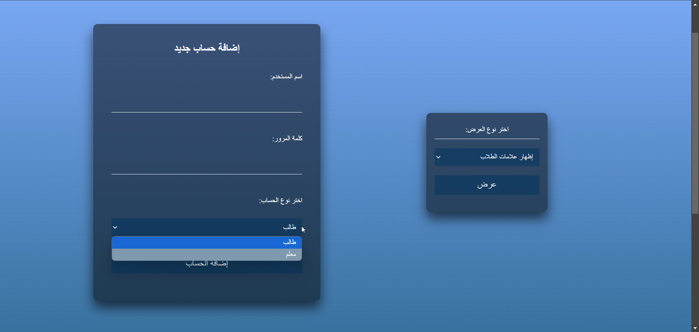
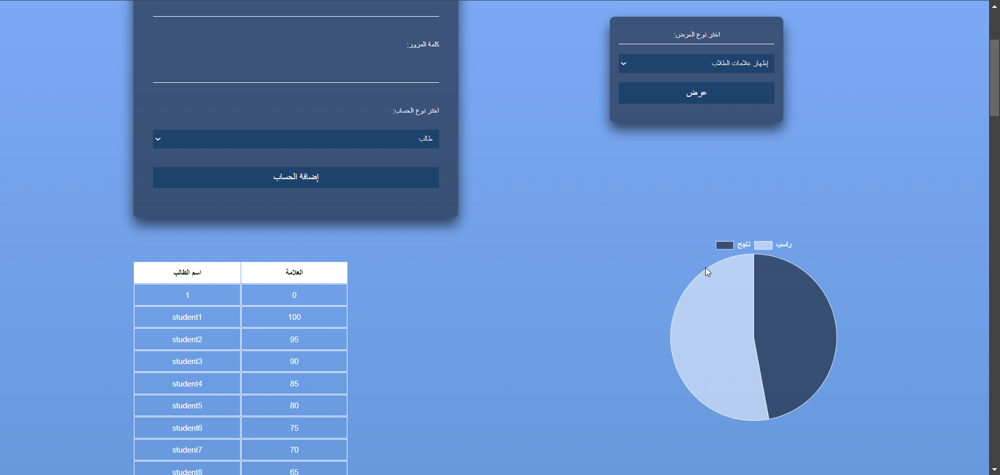

## Introduction:

With the implementation of containment measures to control the virus, universities and schools worldwide have shifted to remote learning. Distance learning, supported by emerging technologies, has allowed education to continue in many parts of the world.  
Schools, colleges, and universities now rely on remote learning to bridge geographical and time gaps. It’s an effective method for expanding classrooms without necessarily expanding physical infrastructure.  

Although distance learning brings its own challenges, this research provides an in-depth analysis of the challenges we face and how we can address them.  
Some of the key challenges include:
- **Adaptability:** Difficulty in adjusting to a new form of learning.
- **Distraction:** Various interruptions while studying at home.
- **Technical Issues:** Internet connectivity and device problems.
- **Computer Literacy:** Students' familiarity with digital platforms.
- **Lack of Motivation and Support:** Especially in a non-physical environment.
- **Ease of Cheating:** During online exams, it becomes easier to cheat.

In this research, we will focus on how to control cheating during exams and how AI can be used to achieve this goal.

## Objective:

The main objective of this project is to monitor students during exams to prevent cheating, using artificial intelligence. Various solutions have been proposed to combat cheating in exams, such as hiring remote proctors or setting a strict time limit for the exam. However, these attempts have largely failed.  

A new idea emerged — using the camera to monitor the student automatically without human intervention. The system would make a decision based on the student's behavior to either allow or disqualify them from the exam.

## Exam Process:

The exam is conducted by having students log in to a dedicated website where they will be presented with the exam questions. After logging in, the camera is activated and monitors the student throughout the exam to prevent cheating attempts.  

If any cheating behavior is detected (such as looking away from the screen for a long time or having another person present), the system immediately flags the student and adds them to a **penalty list**. Students on this list may face consequences such as having their exams voided or receiving further academic penalties.

The website was developed using **Node.js** and **JavaScript** for backend functionality and logic. The web pages were designed and styled using modern web technologies to ensure a smooth user experience during the exam process.

## The Algorithm:

- **Face Detection:** Detect the student’s face during the exam.
- **Eye Detection:** Identify the position and orientation of the eyes.
- **Calculate Eye Angle:** Measure the tilt of the eyes.
- If the head tilt goes beyond a certain threshold, the system will decide to disqualify the student from the exam.
- Once disqualified, the student's account will be blocked from sending any further data to the system. If no violation is detected, the process repeats.

## Face Detection with Mediapipe:

Using the Mediapipe library, we can detect faces and determine whether the student is looking at the screen based on the tilt of their eyes and the position of their nose in relation to their chin.

### Model Selection:

The `model_selection` parameter allows choosing between two models:
- **Model 0:** Detects faces within a 2-meter range of the camera.
- **Model 1:** Detects faces within a 5-meter range.

```python
import mediapipe as mp

mp_face_detection = mp.solutions.face_detection
face_detection = mp_face_detection.FaceDetection(model_selection=0, min_detection_confidence=0.5)
mp_drawing = mp.solutions.drawing_utils
```
## How the system works
Log in either with a student account or a teacher account.

## When you log in as a student
the questions will be displayed, the student will choose the answers, and then the student's score will be calculated and displayed after the student has chosen the answers.

## When you log in as a teacher
The number of questions to be written will be chosen by the teacher.

After selecting the number of questions, the fields will appear, the question will be written with its answers, and the correct answer will be selected for electronic correction.

## Administration page
Through this page, accounts will be created for either the teacher or the student.

It is also possible to display a report on the number of failed and successful students and other matters.

In short, this project aims to create a smart monitoring system to detect and prevent cheating during remote exams. The camera is automatically turned on when the exam starts to monitor student behavior, and if any cheating attempts are detected, the student is immediately recorded and added to the sanctions list. This system allows exams to be conducted in a safe and reliable manner, ensuring academic integrity in remote learning environments.
